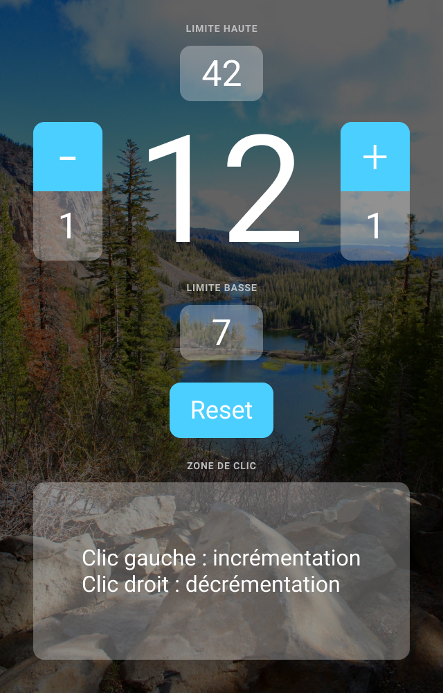

# Informations pour intégrer la maquette

Cet exercice est facultatif.

Vous n'avez pas besoin de JavaScript pour réaliser cette maquette. Vous pouvez la faire uniquement en HTML/CSS.

Même si je n'enseigne pas le HTML/CSS dans cette formation, je me suis dis que vous faire pratiquer un peu ces langages ne vous ferait pas de mal !

Je vous indique ici tout ce qu'il faut pour réaliser l'intégration du design de ce projet si vous souhaitez vous entraîner et perfectionner votre HTML/CSS. Bon courage 😃.

## Dimensions

La maquette fait **640px** de largeur et **1000px** de hauteur.

Ça veut dire que si le *viewport* de votre navigateur fait cette taille, vous devriez obtenir le design approprié.

## Fonte
[Roboto Regular 400](https://fonts.google.com/specimen/Roboto)

Taille des textes :
- titres (limite haute, limite basse, zone de clic) : **14px**
- bouton - et + et input : **52px**
- gros compteur : **216px**
- bouton reset : **36px**
- texte dans la zone de clic : **32px**

## Couleurs
- bleu des boutons : **#4bcfff**
- bleu clair lors du hover des boutons: **#9ae2fc**
- contour bleu au survol (hover) et au focus des inputs : **0 0 0 6px rgba(75, 207, 255, .75)**
- gris des titres : **#bdbec0**
- couleur de fond semi-transparent pour les input : **rgba(255, 255, 255, 0.3)**
- couleur de fond actif de la zone de clic : **rgba(255, 255, 255, 0.5)**
- fond rouge pour la notification : **#ff866e**

## Image de fond

L'image de fond est [disponible ici](../images/fond.jpg).

Il y a un overlay sur l'image de fond pour la rendre plus sombre avec la couleur semi-transparente : **rgba(0,0,0,.6)**

## Image du design

Voici le design à intégrer ([image ici](./design.jpg)):

## Solution

Vous trouverez *une solution possible* pour réaliser cette intégration dans le fichier [index.html](../index.html) de ce dossier.