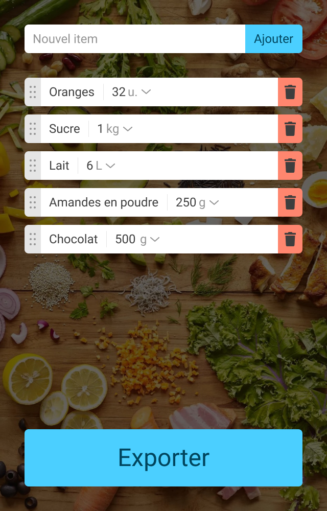

# Informations pour intégrer la maquette

Cet exercice est facultatif.

Vous n'avez pas besoin de JavaScript pour réaliser cette maquette. Vous pouvez la faire uniquement en HTML/CSS.

Même si je n'enseigne pas le HTML/CSS dans cette formation, je me suis dis que vous faire pratiquer un peu ces langages ne vous ferait pas de mal !

Je vous indique ici tout ce qu'il faut pour réaliser l'intégration du design de ce projet si vous souhaitez vous entraîner et perfectionner votre HTML/CSS. Bon courage 😃.

## Dimensions

La maquette fait **640px** de largeur et **1000px** de hauteur.

Ça veut dire que si le *viewport* de votre navigateur fait cette taille, vous devriez obtenir le design approprié.

## Fonte
[Roboto Regular 400](https://fonts.google.com/specimen/Roboto)

Taille des textes :

- body : **24px**
- bouton exporter : **48px**

## Couleurs
- Les gris :
    - Placeholder, barres verticales et horizontales de séparation : #E5E5E5
    - Symbole des unités + flèches menu des unités + symbole poubelle : #949494
    - Texte : #3E3E3E 
- Les bleus :
    - Fond des boutons : #4BCFFF
    - Texte des boutons : #00455E
- Fond rouge de l'icône poubelle : #FF866E

## Autres styles

Les arrondis font tous **8px**.

L'ombre sur le menu des unités est : **box-shadow: 0px 0px 8px rgba(0, 0, 0, 0.25)**

## Images

L'image de fond est [disponible ici](../images/fond.jpg).
L'image de l'icône poubelle est [disponible ici](../images/poubelle.svg).
L'image de la poignée (6 ronds sur fond gris à gauche de chaque item) est [disponible ici](../images/poignee.svg).

Il y a un overlay sur l'image de fond pour la rendre plus sombre avec la couleur semi-transparente : **rgba(0,0,0,.6)**

## Image du design

Voici le design à intégrer ([image ici](./design.jpg)):

