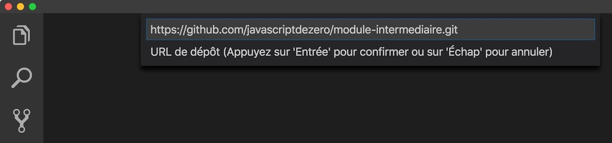
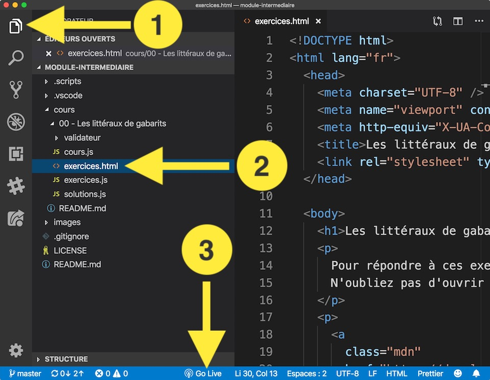
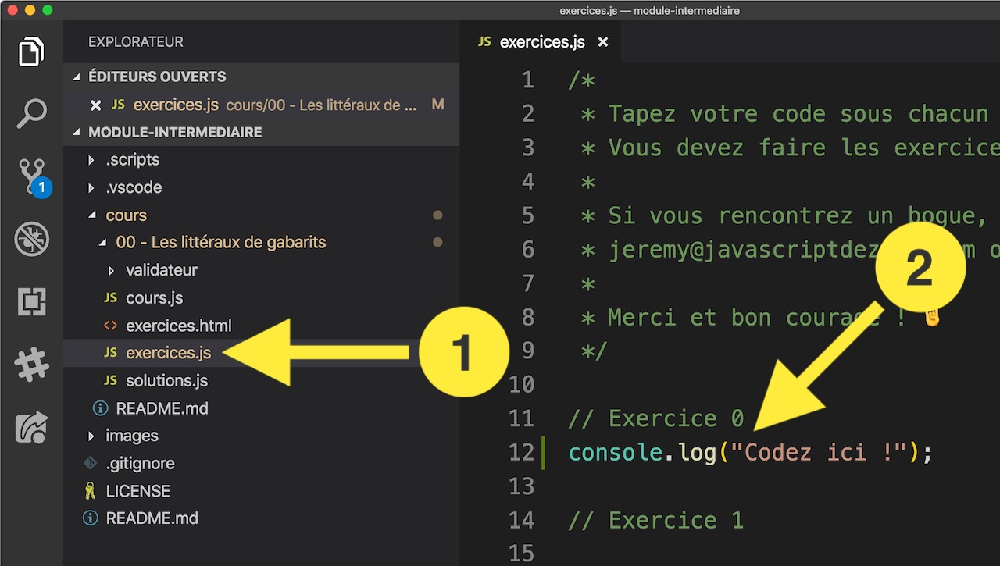

# Exercices

> Les noms de fichiers et répertoires sont sans accents pour éviter des problèmes dans Visual Studio Code.

## Comment faire les exercices ?

> Si vous avez déjà installé les exercices du module débutant, vous pouvez passer directement à l'étape 5.

Voici les instructions à suivre pour faire les exercices depuis Visual Studio Code.

1. Ouvrez Visual Studio Code.
2. Allez dans l'onglet **Extensions** en cliquant sur l'icône depuis le panneau latéral de gauche. Vous pouvez également utiliser le raccourci clavier `⇧⌘X` sur Mac ou `Ctrl+Shift+X` sous Windows/Linux.

3. Installez l'extension **live server** (par Ritwick Dey).
   
4. Redémarrez Visual Studio Code pour prendre en compte cette extension.
5. Téléchargez le dépôt GitHub de la formation :
   1. Ouvrez la palette de commandes depuis le menu **Afficher > Palette de commandes** (raccourci clavier `⇧⌘P` sur Mac ou `Ctrl+Shift+P` sous Windows/Linux) puis tapez `git clone` et validez avec ENTRÉE.
      
   2. Si une erreur apparaît en bas à droite après avoir appuyé sur ENTRÉE il faut [installer Git](#installer-git) avant de continuer. Une fois que c'est fait suivez les instructions suivantes.
      
   3. Copier-collez le lien du dépôt GitHub de la formation et validez : https://github.com/javascriptdezero/module-intermediaire.git (attention à ne pas insérer d'espace en trop à la fin du lien !)
      
   4. Visual Studio Code va vous demander dans quel répertoire vous voulez télécharger le dépôt GitHub de la formation. Sélectionnez le répertoire de votre choix (par exemple **Documents**), puis validez.
   5. Une fois le téléchargement effectué vous aurez un nouveau répertoire **Documents/module-intermediaire**. Visual Studio Code va vous demander dans une popup en bas à droite si vous voulez ouvrir le dépôt cloné : cliquez sur le bouton **Ouvrir le dépôt**.
      
   6. Si vous ne voyez pas la popup de l'étape précédente, utilisez le menu **Fichier > Ouvrir** puis sélectionnez le répertoire **Documents/module-intermediaire**. Sélectionnez bien le répertoire **module-intermediaire** et pas **Documents** avant de cliquer sur `Ouvrir`.
6. Dans ce nouveau projet, cliquez sur le répertoire **cours** puis sur le cours de votre choix par exemple **00 - Les littéraux de gabarits**.
   
7. Sélectionnez le fichier **exercices.html** (ou un des fichiers se terminant par **.html**).
8. Lancez le serveur Web en cliquant sur **Go Live** tout en bas dans la barre d'état bleue.
9. Le navigateur Chrome devrait se lancer tout seul et vous afficher les exercices.
10. Dernière étape ouvrez le fichier **exercices.js** (ou le fichier se terminant par **.js**) pour commencer à coder vos réponses !
    
11. Dès que vous enregistrez vos modifications dans le fichier **exercices.js** le navigateur se mettra à jour et vous dira si vous avez réussi ou pas les exercices. Bon courage !

12. Pour faire les exercices d'un autre cours, il suffit de recommencer à l'étape 6 en sélectionnant le cours de votre choix.
13. Comme je mets à jour régulièrement les exercices, pensez à lire la section [mettre à jour le dépôt Git de la formation](#Mettre-à-jour-le-dépôt-Git-de-la-formation).
14. Pour toute question, merci de me contacter par email sur jeremy@javascriptdezero.com.

### Mettre à jour le dépôt Git de la formation

Je mets à jour le dépôt Git de la formation régulièrement en ajoutant de nouveaux exercices et du contenu. Pensez à mettre à jour votre dépôt de temps en temps en suivant les instructions ci-dessous.

> Vous devez être connecté à Internet pour que la mise à jour puisse s'effectuer.

Voici les étapes à suivre en image :

Quelques explications plus détaillées :

1. Ouvrez Visual Studio Code.
2. Ouvrez le dépôt Git de la formation : allez dans le menu **Fichier > Ouvrir** et sélectionnez le répertoire du dépôt sur votre ordinateur (**Documents/module-intermediaire** pour continuer sur notre exemple).
3. Depuis ce projet, sélectionnez sur le panneau latéral gauche l'icône **debug** (étape 1 de l'image).
4. Sélectionnez **Mettre à jour le dépôt** dans le menu déroulant du haut (étape 2 de l'image).
5. Ouvrez la console de déboguage : cliquez sur l'icône terminal à droite du menu déroulant (étape 3 de l'image).
6. Lancez la mise à jour en cliquant sur le bouton **Lecture** à gauche du menu déroulant (étape 4 de l'image).
7. Vérifiez que tout se passe bien dans la console de déboguage.

J'ai créé ce procédé pour faciliter l'accès aux exercices par les néophytes qui ne connaissent pas Git.

Mais si vous connaissez Git vous n'avez pas besoin d'utiliser ce processus pour mettre à jour le dépôt. Vous pouvez simplement faire des `git pull` de temps en temps.

### Installer Git

Si l'erreur suivante apparaît après avoir tapé `git clone` dans la palette de commandes :

C'est qu'il faut installer Git sur votre machine :

1. Rendez-vous sur [git-scm.com](https://git-scm.com/download).
2. Cliquez sur le système d'exploitation que vous utilisez (Windows ou Linux ou Mac OS).
   
3. Installez Git (cliquez sur **Next** plusieurs fois). Vérifiez bien de sélectionner l'option **Use Git from the Windows Command Prompt** lorsque cet écran s'affiche :

   

4. Cliquez sur **Next** jusqu'à la fin de l'installation de Git.
5. Une fois que c'est fait, fermez complètement Visual Studio Code et relancez-le. Vous pourrez maintenant utiliser la commande `git clone` dans la palette de commandes.

### Approche générale

Ces exercices ont été conçus pour vous permettre de valider par la pratique chaque leçon.

Le but est de commencer avec un exercice bête et méchant qui applique sans piège une connaissance enseignée dans la vidéo.

Petit à petit, la difficulté augmente jusqu'à finir par poser des questions qui ne sont pas traitées dans la leçon.

Vous devrez alors vous entraîner à consulter la documentation pour trouver comment faire. C'est là toute l'essence du métier de développeur : réussir à chercher par soi-même la réponse à un problème donné.

### Chassez les bogues !

L'objectif de ce type d'exercice est de trouver et corriger le ou les bogues d'un programme informatique.

Là aussi il s'agit d'entraîner votre logique et votre capacité de lecture et d'analyse d'un programme informatique écrit par autrui. Une compétence indispensable pour devenir développeur et contribuer à des projets déjà existants.

### Bonnes pratiques

Voici quelques conseils pour résoudre les exercices :

- Prenez votre temps, ce n'est pas chronométré !
- Modifiez le nom des variables si ça vous aide à mieux comprendre la logique du programme
- Formatez le programme pour séparer les différentes phases de celui-ci, quelques lignes vides et espaces bien placés font parfois des miracles !
- Résolvez les exercices dans l'ordre. La difficulté est croissante et certains exercices utilisent le précédent comme base de solution
- Utilisez le débogueur pour vous aider à comprendre le fonctionnement du programme rapidement
- Si vous bloquez sur un exercice, prenez une pause comme je l'explique dans la section ["Sortir d'une situation bloquante" sur cette vidéo](https://www.youtube.com/watch?v=LtsubKU8dzA&t=298s).

### Contributions

Vous pouvez contribuer et me soumettre vos propres exercices pour enrichir la liste !

Si vous résolvez un exercice non listé ici qui vous a permis d'apprendre quelque chose, transmettez-le moi. Je l'ajouterai avec plaisir pour en faire bénéficier la communauté.

Vous pouvez m'envoyer un email à cette adresse : jeremy@javascriptdezero.com. Vous pouvez également utiliser les _pull requests_ de GitHub.
