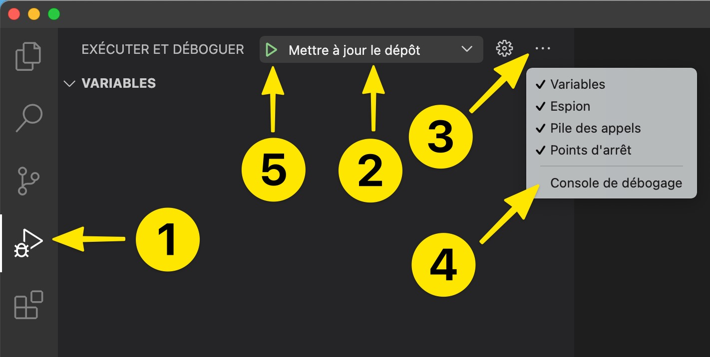

# Cours & Exercices

## Cours

Pour suivre le cours du module intermédiaire, rendez-vous sur le [module intermédiaire du site JavaScript de Zéro](https://www.javascriptdezero.com/module-intermediaire).

## Exercices

Pour faire les exercices du module intermédiaire il suffit de suivre la même procédure que pour le module débutant.

> Vous n'avez pas besoin de réinstaller Git ni Live Server puisque vous l'avez déjà fait pour le module débutant.

Il vous suffit donc simplement de cloner le dépôt du module intermédiaire à [l'étape 3 (point n°2)](https://github.com/javascriptdezero/module-debutant/tree/master/cours#%C3%A9tape-3--cloner-le-d%C3%A9p%C3%B4t-du-module-d%C3%A9butant) en utilisant ce lien ci-dessous à la place de celui du module débutant :

[https://github.com/javascriptdezero/module-intermediaire.git](https://github.com/javascriptdezero/module-intermediaire.git)

Pour tout problème, contactez-moi par email à cette adresse : jeremy@javascriptdezero.com. Merci.

## Mettre à jour ce dépôt

Comme ce module n'est pas terminé, je mets à jour régulièrement celui-ci chaque vendredi matin avec du nouveau contenu.

Pensez à mettre à jour ce dépôt pour récupérer les nouveaux cours & exercices.

> Vous devez être connecté à Internet pour que la mise à jour puisse s'effectuer.

Voici les étapes à suivre en image :

Explications détaillées :

1. Ouvrez Visual Studio Code.
2. Ouvrez le répertoire où vous avez cloné le module intermédiaire : allez dans le menu **Fichier > Ouvrir** et sélectionnez le répertoire du dépôt sur votre ordinateur (**Documents/module-intermediaire** par exemple).
3. Sélectionnez sur le panneau latéral gauche l'icône **debug** (étape 1 de l'image).
4. Sélectionnez **Mettre à jour le dépôt** dans le menu déroulant du haut (étape 2 de l'image).
5. Ouvrez la console de déboguage : cliquez sur l'icône terminal à droite du menu déroulant (étape 3 de l'image).
6. Lancez la mise à jour en cliquant sur le bouton **Lecture** à gauche du menu déroulant (étape 4 de l'image).
7. Vérifiez que tout se passe bien dans la console de déboguage.

J'ai créé ce processus pour faciliter la mise à jour pour les néophytes qui ne connaissent pas Git.

Mais si vous connaissez Git vous n'avez pas besoin d'utiliser ce processus pour mettre à jour le dépôt. Vous pouvez simplement faire des `git pull` de temps en temps.
